# Credit Card Fraud Detection


```python

import pandas as pd
import matplotlib.pyplot as plt
import numpy as np
import seaborn as sns
from sklearn.preprocessing import StandardScaler
from sklearn.linear_model import LogisticRegression
from sklearn.metrics import f1_score,recall_score,accuracy_score,precision_score
from sklearn.model_selection import StratifiedKFold
from sklearn.metrics import precision_recall_curve
import matplotlib.pyplot as plt
from sklearn.metrics import confusion_matrix
from sklearn.model_selection import train_test_split
from sklearn.tree import DecisionTreeClassifier
from sklearn.cluster import KMeans
from sklearn.naive_bayes import GaussianNB
from sklearn.ensemble import RandomForestClassifier

```


```python
#read train and test datasets

df = pd.read_csv('fraudTest.csv',index_col=[0])
```


```python
df.shape
```


    (555719, 22)


```python
df.columns
```


    Index(['trans_date_trans_time', 'cc_num', 'merchant', 'category', 'amt',
           'first', 'last', 'gender', 'street', 'city', 'state', 'zip', 'lat',
           'long', 'city_pop', 'job', 'dob', 'trans_num', 'unix_time', 'merch_lat',
           'merch_long', 'is_fraud'],
          dtype='object')


```python
df['is_fraud'].value_counts()
```


    0    553574
    1      2145
    Name: is_fraud, dtype: int64


```python
fraudulent_rows = df[df['is_fraud'] == 0]
random_selection = fraudulent_rows.sample(n=500000)
df = df.drop(random_selection.index)
df.reset_index(drop=True, inplace=True)
df.shape
```


    (55719, 22)


```python
df['is_fraud'].value_counts()
```


    0    53574
    1     2145
    Name: is_fraud, dtype: int64


```python
plt.figure(figsize = [7,7])
plot_var = df['is_fraud'].value_counts(normalize = True)
plt.pie(plot_var,
        autopct='%1.1f%%',
        labels = ['non_fraud','fraud'], 
        explode = [0.2, 0], 
        shadow = True)
plt.title('Distribution of the Target');
```


    
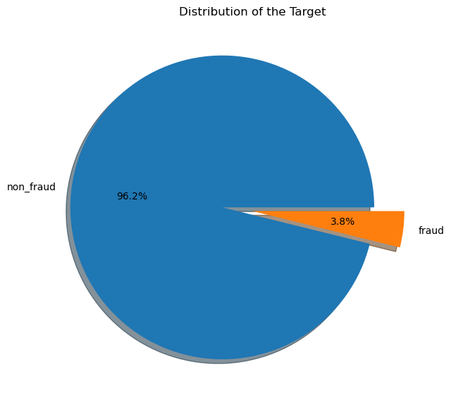
    


```python
df.head(5)
```


<div>
<style scoped>
    .dataframe tbody tr th:only-of-type {
        vertical-align: middle;
    }

    .dataframe tbody tr th {
        vertical-align: top;
    }

    .dataframe thead th {
        text-align: right;
    }
</style>
<table border="1" class="dataframe">
  <thead>
    <tr style="text-align: right;">
      <th></th>
      <th>trans_date_trans_time</th>
      <th>cc_num</th>
      <th>merchant</th>
      <th>category</th>
      <th>amt</th>
      <th>first</th>
      <th>last</th>
      <th>gender</th>
      <th>street</th>
      <th>city</th>
      <th>...</th>
      <th>lat</th>
      <th>long</th>
      <th>city_pop</th>
      <th>job</th>
      <th>dob</th>
      <th>trans_num</th>
      <th>unix_time</th>
      <th>merch_lat</th>
      <th>merch_long</th>
      <th>is_fraud</th>
    </tr>
  </thead>
  <tbody>
    <tr>
      <th>0</th>
      <td>2020-06-21 12:15:37</td>
      <td>30407675418785</td>
      <td>fraud_Daugherty LLC</td>
      <td>kids_pets</td>
      <td>19.55</td>
      <td>Danielle</td>
      <td>Evans</td>
      <td>F</td>
      <td>76752 David Lodge Apt. 064</td>
      <td>Breesport</td>
      <td>...</td>
      <td>42.1939</td>
      <td>-76.7361</td>
      <td>520</td>
      <td>Psychotherapist</td>
      <td>1991-10-13</td>
      <td>798db04aaceb4febd084f1a7c404da93</td>
      <td>1371816937</td>
      <td>41.747157</td>
      <td>-77.584197</td>
      <td>0</td>
    </tr>
    <tr>
      <th>1</th>
      <td>2020-06-21 12:16:47</td>
      <td>571465035400</td>
      <td>fraud_Gottlieb Group</td>
      <td>kids_pets</td>
      <td>42.40</td>
      <td>Louis</td>
      <td>Fisher</td>
      <td>M</td>
      <td>45654 Hess Rest</td>
      <td>Fort Washakie</td>
      <td>...</td>
      <td>43.0048</td>
      <td>-108.8964</td>
      <td>1645</td>
      <td>Freight forwarder</td>
      <td>1976-02-26</td>
      <td>fa3071565d94fb286cb0ed398c6d61d3</td>
      <td>1371817007</td>
      <td>42.687774</td>
      <td>-108.670054</td>
      <td>0</td>
    </tr>
    <tr>
      <th>2</th>
      <td>2020-06-21 12:18:41</td>
      <td>4570636521433188</td>
      <td>fraud_Welch, Rath and Koepp</td>
      <td>entertainment</td>
      <td>24.73</td>
      <td>Christine</td>
      <td>Leblanc</td>
      <td>F</td>
      <td>5097 Jodi Vista Suite 811</td>
      <td>Deltona</td>
      <td>...</td>
      <td>28.8989</td>
      <td>-81.2473</td>
      <td>88735</td>
      <td>Commercial horticulturist</td>
      <td>1988-04-09</td>
      <td>ea11379e8aa1b08d584149d65770faee</td>
      <td>1371817121</td>
      <td>29.831550</td>
      <td>-80.926829</td>
      <td>0</td>
    </tr>
    <tr>
      <th>3</th>
      <td>2020-06-21 12:25:09</td>
      <td>379897244598068</td>
      <td>fraud_Kautzer and Sons</td>
      <td>personal_care</td>
      <td>176.23</td>
      <td>Frank</td>
      <td>Key</td>
      <td>M</td>
      <td>5537 Jessica Plaza</td>
      <td>Pewee Valley</td>
      <td>...</td>
      <td>38.3039</td>
      <td>-85.4834</td>
      <td>3263</td>
      <td>Stage manager</td>
      <td>1930-02-28</td>
      <td>3f5587dd43e45910ba221bc3a4dfdd3f</td>
      <td>1371817509</td>
      <td>38.585316</td>
      <td>-86.108185</td>
      <td>0</td>
    </tr>
    <tr>
      <th>4</th>
      <td>2020-06-21 12:26:13</td>
      <td>4302475216404898</td>
      <td>fraud_Zemlak, Tillman and Cremin</td>
      <td>personal_care</td>
      <td>19.03</td>
      <td>Daniel</td>
      <td>Cain</td>
      <td>M</td>
      <td>384 Newman Forks Apt. 370</td>
      <td>Belmond</td>
      <td>...</td>
      <td>42.8511</td>
      <td>-93.6200</td>
      <td>3032</td>
      <td>Community pharmacist</td>
      <td>1964-08-08</td>
      <td>cd10a7d08e9262899109c06a8e180302</td>
      <td>1371817573</td>
      <td>42.322809</td>
      <td>-94.363655</td>
      <td>0</td>
    </tr>
  </tbody>
</table>
<p>5 rows × 22 columns</p>
</div>


# Data Cleaning


```python
data = df
data.isna().sum()
```


    trans_date_trans_time    0
    cc_num                   0
    merchant                 0
    category                 0
    amt                      0
    first                    0
    last                     0
    gender                   0
    street                   0
    city                     0
    state                    0
    zip                      0
    lat                      0
    long                     0
    city_pop                 0
    job                      0
    dob                      0
    trans_num                0
    unix_time                0
    merch_lat                0
    merch_long               0
    is_fraud                 0
    dtype: int64


```python
#Removing duplicate rows

data.drop_duplicates(inplace=True)
```


```python
data.shape
```


    (55719, 22)


```python
data.dtypes
```


    trans_date_trans_time     object
    cc_num                     int64
    merchant                  object
    category                  object
    amt                      float64
    first                     object
    last                      object
    gender                    object
    street                    object
    city                      object
    state                     object
    zip                        int64
    lat                      float64
    long                     float64
    city_pop                   int64
    job                       object
    dob                       object
    trans_num                 object
    unix_time                  int64
    merch_lat                float64
    merch_long               float64
    is_fraud                   int64
    dtype: object


```python
#Modifying datatypes
#changing object to datetime format

data['trans_date_trans_time'] = pd.to_datetime(data['trans_date_trans_time'])
data['dob'] = pd.to_datetime(data['dob'])
```


```python
data.dtypes
```


    trans_date_trans_time    datetime64[ns]
    cc_num                            int64
    merchant                         object
    category                         object
    amt                             float64
    first                            object
    last                             object
    gender                           object
    street                           object
    city                             object
    state                            object
    zip                               int64
    lat                             float64
    long                            float64
    city_pop                          int64
    job                              object
    dob                      datetime64[ns]
    trans_num                        object
    unix_time                         int64
    merch_lat                       float64
    merch_long                      float64
    is_fraud                          int64
    dtype: object


```python
data.head(5)
```


<div>
<style scoped>
    .dataframe tbody tr th:only-of-type {
        vertical-align: middle;
    }

    .dataframe tbody tr th {
        vertical-align: top;
    }

    .dataframe thead th {
        text-align: right;
    }
</style>
<table border="1" class="dataframe">
  <thead>
    <tr style="text-align: right;">
      <th></th>
      <th>trans_date_trans_time</th>
      <th>cc_num</th>
      <th>merchant</th>
      <th>category</th>
      <th>amt</th>
      <th>first</th>
      <th>last</th>
      <th>gender</th>
      <th>street</th>
      <th>city</th>
      <th>...</th>
      <th>lat</th>
      <th>long</th>
      <th>city_pop</th>
      <th>job</th>
      <th>dob</th>
      <th>trans_num</th>
      <th>unix_time</th>
      <th>merch_lat</th>
      <th>merch_long</th>
      <th>is_fraud</th>
    </tr>
  </thead>
  <tbody>
    <tr>
      <th>0</th>
      <td>2020-06-21 12:15:37</td>
      <td>30407675418785</td>
      <td>fraud_Daugherty LLC</td>
      <td>kids_pets</td>
      <td>19.55</td>
      <td>Danielle</td>
      <td>Evans</td>
      <td>F</td>
      <td>76752 David Lodge Apt. 064</td>
      <td>Breesport</td>
      <td>...</td>
      <td>42.1939</td>
      <td>-76.7361</td>
      <td>520</td>
      <td>Psychotherapist</td>
      <td>1991-10-13</td>
      <td>798db04aaceb4febd084f1a7c404da93</td>
      <td>1371816937</td>
      <td>41.747157</td>
      <td>-77.584197</td>
      <td>0</td>
    </tr>
    <tr>
      <th>1</th>
      <td>2020-06-21 12:16:47</td>
      <td>571465035400</td>
      <td>fraud_Gottlieb Group</td>
      <td>kids_pets</td>
      <td>42.40</td>
      <td>Louis</td>
      <td>Fisher</td>
      <td>M</td>
      <td>45654 Hess Rest</td>
      <td>Fort Washakie</td>
      <td>...</td>
      <td>43.0048</td>
      <td>-108.8964</td>
      <td>1645</td>
      <td>Freight forwarder</td>
      <td>1976-02-26</td>
      <td>fa3071565d94fb286cb0ed398c6d61d3</td>
      <td>1371817007</td>
      <td>42.687774</td>
      <td>-108.670054</td>
      <td>0</td>
    </tr>
    <tr>
      <th>2</th>
      <td>2020-06-21 12:18:41</td>
      <td>4570636521433188</td>
      <td>fraud_Welch, Rath and Koepp</td>
      <td>entertainment</td>
      <td>24.73</td>
      <td>Christine</td>
      <td>Leblanc</td>
      <td>F</td>
      <td>5097 Jodi Vista Suite 811</td>
      <td>Deltona</td>
      <td>...</td>
      <td>28.8989</td>
      <td>-81.2473</td>
      <td>88735</td>
      <td>Commercial horticulturist</td>
      <td>1988-04-09</td>
      <td>ea11379e8aa1b08d584149d65770faee</td>
      <td>1371817121</td>
      <td>29.831550</td>
      <td>-80.926829</td>
      <td>0</td>
    </tr>
    <tr>
      <th>3</th>
      <td>2020-06-21 12:25:09</td>
      <td>379897244598068</td>
      <td>fraud_Kautzer and Sons</td>
      <td>personal_care</td>
      <td>176.23</td>
      <td>Frank</td>
      <td>Key</td>
      <td>M</td>
      <td>5537 Jessica Plaza</td>
      <td>Pewee Valley</td>
      <td>...</td>
      <td>38.3039</td>
      <td>-85.4834</td>
      <td>3263</td>
      <td>Stage manager</td>
      <td>1930-02-28</td>
      <td>3f5587dd43e45910ba221bc3a4dfdd3f</td>
      <td>1371817509</td>
      <td>38.585316</td>
      <td>-86.108185</td>
      <td>0</td>
    </tr>
    <tr>
      <th>4</th>
      <td>2020-06-21 12:26:13</td>
      <td>4302475216404898</td>
      <td>fraud_Zemlak, Tillman and Cremin</td>
      <td>personal_care</td>
      <td>19.03</td>
      <td>Daniel</td>
      <td>Cain</td>
      <td>M</td>
      <td>384 Newman Forks Apt. 370</td>
      <td>Belmond</td>
      <td>...</td>
      <td>42.8511</td>
      <td>-93.6200</td>
      <td>3032</td>
      <td>Community pharmacist</td>
      <td>1964-08-08</td>
      <td>cd10a7d08e9262899109c06a8e180302</td>
      <td>1371817573</td>
      <td>42.322809</td>
      <td>-94.363655</td>
      <td>0</td>
    </tr>
  </tbody>
</table>
<p>5 rows × 22 columns</p>
</div>


```python
data['trans_date_trans_time'].value_counts().sum()
```


    55719


```python
#Splitting columns
#split trans_date_trans_time to year-month, day, hour

data['hour'] = data['trans_date_trans_time'].dt.hour
data['day'] = data['trans_date_trans_time'].dt.day_name().str[:3]
data['year-month'] = data['trans_date_trans_time'].dt.to_period('M')

```


```python
data.columns
```


    Index(['trans_date_trans_time', 'cc_num', 'merchant', 'category', 'amt',
           'first', 'last', 'gender', 'street', 'city', 'state', 'zip', 'lat',
           'long', 'city_pop', 'job', 'dob', 'trans_num', 'unix_time', 'merch_lat',
           'merch_long', 'is_fraud', 'hour', 'day', 'year-month'],
          dtype='object')


```python
data.head(5)
```


<div>
<style scoped>
    .dataframe tbody tr th:only-of-type {
        vertical-align: middle;
    }

    .dataframe tbody tr th {
        vertical-align: top;
    }

    .dataframe thead th {
        text-align: right;
    }
</style>
<table border="1" class="dataframe">
  <thead>
    <tr style="text-align: right;">
      <th></th>
      <th>trans_date_trans_time</th>
      <th>cc_num</th>
      <th>merchant</th>
      <th>category</th>
      <th>amt</th>
      <th>first</th>
      <th>last</th>
      <th>gender</th>
      <th>street</th>
      <th>city</th>
      <th>...</th>
      <th>job</th>
      <th>dob</th>
      <th>trans_num</th>
      <th>unix_time</th>
      <th>merch_lat</th>
      <th>merch_long</th>
      <th>is_fraud</th>
      <th>hour</th>
      <th>day</th>
      <th>year-month</th>
    </tr>
  </thead>
  <tbody>
    <tr>
      <th>0</th>
      <td>2020-06-21 12:15:37</td>
      <td>30407675418785</td>
      <td>fraud_Daugherty LLC</td>
      <td>kids_pets</td>
      <td>19.55</td>
      <td>Danielle</td>
      <td>Evans</td>
      <td>F</td>
      <td>76752 David Lodge Apt. 064</td>
      <td>Breesport</td>
      <td>...</td>
      <td>Psychotherapist</td>
      <td>1991-10-13</td>
      <td>798db04aaceb4febd084f1a7c404da93</td>
      <td>1371816937</td>
      <td>41.747157</td>
      <td>-77.584197</td>
      <td>0</td>
      <td>12</td>
      <td>Sun</td>
      <td>2020-06</td>
    </tr>
    <tr>
      <th>1</th>
      <td>2020-06-21 12:16:47</td>
      <td>571465035400</td>
      <td>fraud_Gottlieb Group</td>
      <td>kids_pets</td>
      <td>42.40</td>
      <td>Louis</td>
      <td>Fisher</td>
      <td>M</td>
      <td>45654 Hess Rest</td>
      <td>Fort Washakie</td>
      <td>...</td>
      <td>Freight forwarder</td>
      <td>1976-02-26</td>
      <td>fa3071565d94fb286cb0ed398c6d61d3</td>
      <td>1371817007</td>
      <td>42.687774</td>
      <td>-108.670054</td>
      <td>0</td>
      <td>12</td>
      <td>Sun</td>
      <td>2020-06</td>
    </tr>
    <tr>
      <th>2</th>
      <td>2020-06-21 12:18:41</td>
      <td>4570636521433188</td>
      <td>fraud_Welch, Rath and Koepp</td>
      <td>entertainment</td>
      <td>24.73</td>
      <td>Christine</td>
      <td>Leblanc</td>
      <td>F</td>
      <td>5097 Jodi Vista Suite 811</td>
      <td>Deltona</td>
      <td>...</td>
      <td>Commercial horticulturist</td>
      <td>1988-04-09</td>
      <td>ea11379e8aa1b08d584149d65770faee</td>
      <td>1371817121</td>
      <td>29.831550</td>
      <td>-80.926829</td>
      <td>0</td>
      <td>12</td>
      <td>Sun</td>
      <td>2020-06</td>
    </tr>
    <tr>
      <th>3</th>
      <td>2020-06-21 12:25:09</td>
      <td>379897244598068</td>
      <td>fraud_Kautzer and Sons</td>
      <td>personal_care</td>
      <td>176.23</td>
      <td>Frank</td>
      <td>Key</td>
      <td>M</td>
      <td>5537 Jessica Plaza</td>
      <td>Pewee Valley</td>
      <td>...</td>
      <td>Stage manager</td>
      <td>1930-02-28</td>
      <td>3f5587dd43e45910ba221bc3a4dfdd3f</td>
      <td>1371817509</td>
      <td>38.585316</td>
      <td>-86.108185</td>
      <td>0</td>
      <td>12</td>
      <td>Sun</td>
      <td>2020-06</td>
    </tr>
    <tr>
      <th>4</th>
      <td>2020-06-21 12:26:13</td>
      <td>4302475216404898</td>
      <td>fraud_Zemlak, Tillman and Cremin</td>
      <td>personal_care</td>
      <td>19.03</td>
      <td>Daniel</td>
      <td>Cain</td>
      <td>M</td>
      <td>384 Newman Forks Apt. 370</td>
      <td>Belmond</td>
      <td>...</td>
      <td>Community pharmacist</td>
      <td>1964-08-08</td>
      <td>cd10a7d08e9262899109c06a8e180302</td>
      <td>1371817573</td>
      <td>42.322809</td>
      <td>-94.363655</td>
      <td>0</td>
      <td>12</td>
      <td>Sun</td>
      <td>2020-06</td>
    </tr>
  </tbody>
</table>
<p>5 rows × 25 columns</p>
</div>


```python
data.columns
```


    Index(['trans_date_trans_time', 'cc_num', 'merchant', 'category', 'amt',
           'first', 'last', 'gender', 'street', 'city', 'state', 'zip', 'lat',
           'long', 'city_pop', 'job', 'dob', 'trans_num', 'unix_time', 'merch_lat',
           'merch_long', 'is_fraud', 'hour', 'day', 'year-month'],
          dtype='object')


```python
#Creating a new column – age

data['age'] = np.round((data['trans_date_trans_time']-data['dob'])/np.timedelta64(1,'Y'))

```


```python
data.columns
```


    Index(['trans_date_trans_time', 'cc_num', 'merchant', 'category', 'amt',
           'first', 'last', 'gender', 'street', 'city', 'state', 'zip', 'lat',
           'long', 'city_pop', 'job', 'dob', 'trans_num', 'unix_time', 'merch_lat',
           'merch_long', 'is_fraud', 'hour', 'day', 'year-month', 'age'],
          dtype='object')


```python
data.dtypes
```


    trans_date_trans_time    datetime64[ns]
    cc_num                            int64
    merchant                         object
    category                         object
    amt                             float64
    first                            object
    last                             object
    gender                           object
    street                           object
    city                             object
    state                            object
    zip                               int64
    lat                             float64
    long                            float64
    city_pop                          int64
    job                              object
    dob                      datetime64[ns]
    trans_num                        object
    unix_time                         int64
    merch_lat                       float64
    merch_long                      float64
    is_fraud                          int64
    hour                              int64
    day                              object
    year-month                    period[M]
    age                             float64
    dtype: object


```python
data['age']=data['age'].astype(int)
```


```python
data.dtypes
```


    trans_date_trans_time    datetime64[ns]
    cc_num                            int64
    merchant                         object
    category                         object
    amt                             float64
    first                            object
    last                             object
    gender                           object
    street                           object
    city                             object
    state                            object
    zip                               int64
    lat                             float64
    long                            float64
    city_pop                          int64
    job                              object
    dob                      datetime64[ns]
    trans_num                        object
    unix_time                         int64
    merch_lat                       float64
    merch_long                      float64
    is_fraud                          int64
    hour                              int64
    day                              object
    year-month                    period[M]
    age                               int32
    dtype: object


```python
#Removing unwanted columns

data.drop(['trans_date_trans_time','dob', 'first', 'last'] , axis=1, inplace=True)

```


```python
data.columns
```


    Index(['cc_num', 'merchant', 'category', 'amt', 'gender', 'street', 'city',
           'state', 'zip', 'lat', 'long', 'city_pop', 'job', 'trans_num',
           'unix_time', 'merch_lat', 'merch_long', 'is_fraud', 'hour', 'day',
           'year-month', 'age'],
          dtype='object')


# Exploratory Data Analysis (EDA)


```python
#Histogram representation of the dataset
data.hist(figsize=(14,14))
```


    array([[<Axes: title={'center': 'cc_num'}>,
            <Axes: title={'center': 'amt'}>, <Axes: title={'center': 'zip'}>],
           [<Axes: title={'center': 'lat'}>,
            <Axes: title={'center': 'long'}>,
            <Axes: title={'center': 'city_pop'}>],
           [<Axes: title={'center': 'unix_time'}>,
            <Axes: title={'center': 'merch_lat'}>,
            <Axes: title={'center': 'merch_long'}>],
           [<Axes: title={'center': 'is_fraud'}>,
            <Axes: title={'center': 'hour'}>,
            <Axes: title={'center': 'age'}>]], dtype=object)


    
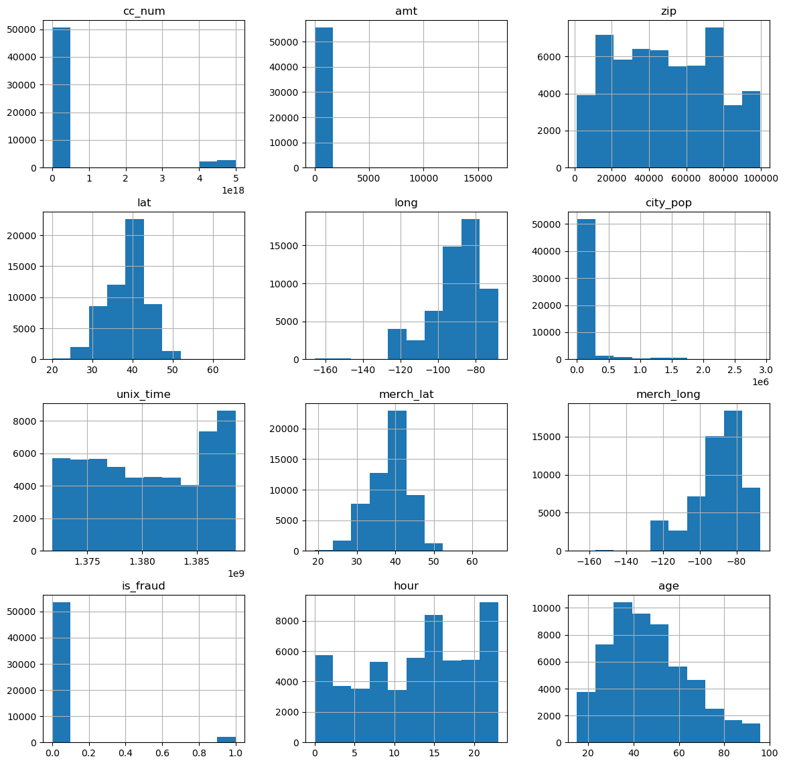
    


```python
#non-fraud and fraud transaction distribution on the basis of gender 

data.hist(column="gender", by="is_fraud")
```


    array([<Axes: title={'center': '0'}>, <Axes: title={'center': '1'}>],
          dtype=object)


    
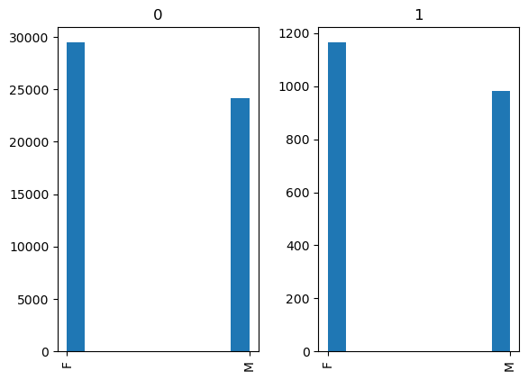
    


```python
# gender pie chart

plt.pie(data['gender'].value_counts().values, labels=data['gender'].value_counts().index, autopct='%1.1f%%')
plt.show()

```


    
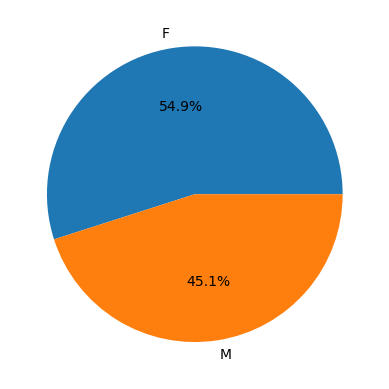
    


```python
#Fraudulent transactions distribution with respect to age of card holders

sns.kdeplot(data=data,x='age', hue='is_fraud',common_norm=False, multiple="stack")

plt.legend(labels=['Fraud', 'Not Fraud'])
```


    <matplotlib.legend.Legend at 0x1b91f433520>


    
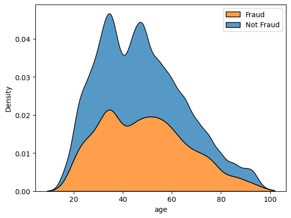
    


```python
#Bar plots for fraud transactions and non-fraud transactions in each state
# Fraud transactions

fraud_data = data[data['is_fraud'] == True]
fraud = fraud_data.groupby('state').size().reset_index(name='fraud')
fig, ax = plt.subplots()
fraud.plot.bar(x='state', y='fraud', ax=ax,color="orange")
plt.show()

```


    
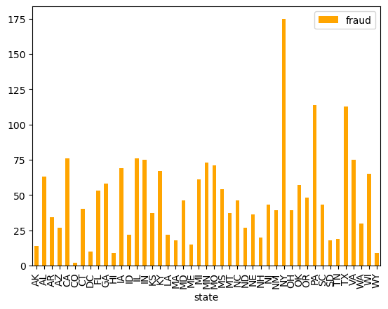
    


```python
# Non-Fraud transactions

fraud_data = data[data['is_fraud'] == False]
non_fraud = fraud_data.groupby('state').size().reset_index(name='non_fraud')
fig, ax = plt.subplots()
non_fraud.plot.bar(x='state', y='non_fraud', ax=ax)
plt.show()
```


    
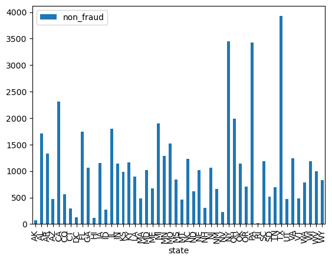
    


```python
# Fraud and Non-Fraud transactions

counts = data.groupby(['state', 'is_fraud']).size().reset_index(name='counts')
pivot = counts.pivot(index='state', columns='is_fraud', values='counts')
fig, ax = plt.subplots()
pivot.plot.bar(ax=ax, stacked=True)
plt.show()
```


    

    


```python
#Geographic distribution of data points

data.plot(kind="scatter", x = "long", y= "lat")
```


    <Axes: xlabel='long', ylabel='lat'>


    
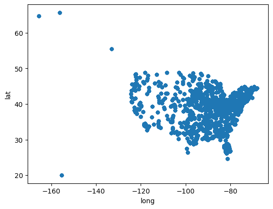
    


```python
data_fraud = data[data['is_fraud'] == 1]
data_fraud.plot(kind="scatter", x = "long", y= "lat")
data_fraud.shape
```


    (2145, 22)


    
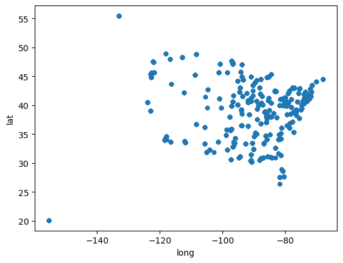
    


```python
data_non_fraud = data[data['is_fraud'] == 0]
data_non_fraud.plot(kind="scatter", x = "long", y= "lat")
data_non_fraud.shape
```


    (53574, 22)


    

    


```python
#population and fraud by location

plt.scatter(data['long'], data['lat'], s=data['city_pop']/10000, c  =data.is_fraud, alpha=0.2)
plt.xlabel('Longitude')
plt.ylabel('Latitude')
```


    Text(0, 0.5, 'Latitude')


    
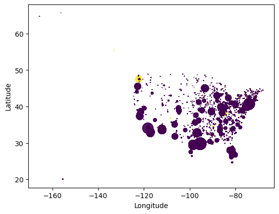
    


```python
#category wise distribution of all data

sns.countplot(y='category', data=data)

```


    <Axes: xlabel='count', ylabel='category'>


    
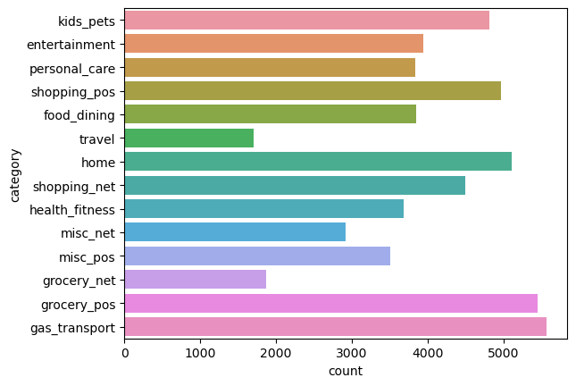
    


```python
data['category'].value_counts()
```


    gas_transport     5566
    grocery_pos       5451
    home              5109
    shopping_pos      4965
    kids_pets         4819
    shopping_net      4494
    entertainment     3945
    food_dining       3850
    personal_care     3835
    health_fitness    3689
    misc_pos          3510
    misc_net          2913
    grocery_net       1869
    travel            1704
    Name: category, dtype: int64


```python
#category wise distribution of fraud data


sns.countplot(y='category', data=data_fraud)

```


    <Axes: xlabel='count', ylabel='category'>


    
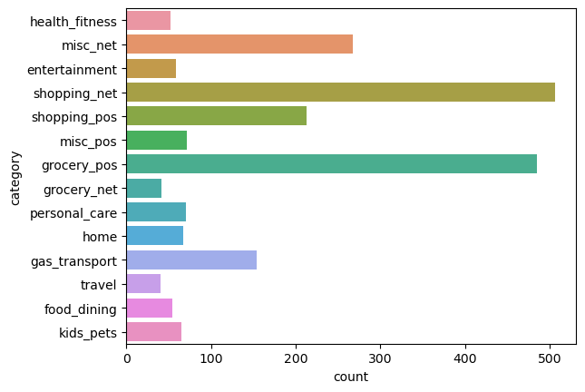
    


```python
data_fraud['category'].value_counts()

```


    shopping_net      506
    grocery_pos       485
    misc_net          267
    shopping_pos      213
    gas_transport     154
    misc_pos           72
    personal_care      70
    home               67
    kids_pets          65
    entertainment      59
    food_dining        54
    health_fitness     52
    grocery_net        41
    travel             40
    Name: category, dtype: int64


```python
#category wise distribution of non-fraud data

sns.countplot(y='category', data=data_non_fraud)
```


    <Axes: xlabel='count', ylabel='category'>


    
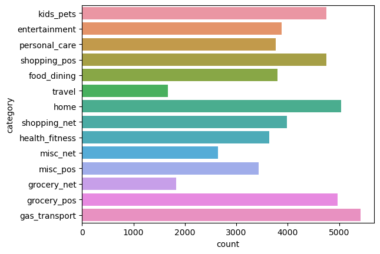
    


```python
data_non_fraud['category'].value_counts()

```


    gas_transport     5412
    home              5042
    grocery_pos       4966
    kids_pets         4754
    shopping_pos      4752
    shopping_net      3988
    entertainment     3886
    food_dining       3796
    personal_care     3765
    health_fitness    3637
    misc_pos          3438
    misc_net          2646
    grocery_net       1828
    travel            1664
    Name: category, dtype: int64


```python
data_copy=data.copy()
data_copy
```


<div>
<style scoped>
    .dataframe tbody tr th:only-of-type {
        vertical-align: middle;
    }

    .dataframe tbody tr th {
        vertical-align: top;
    }

    .dataframe thead th {
        text-align: right;
    }
</style>
<table border="1" class="dataframe">
  <thead>
    <tr style="text-align: right;">
      <th></th>
      <th>cc_num</th>
      <th>merchant</th>
      <th>category</th>
      <th>amt</th>
      <th>gender</th>
      <th>street</th>
      <th>city</th>
      <th>state</th>
      <th>zip</th>
      <th>lat</th>
      <th>...</th>
      <th>job</th>
      <th>trans_num</th>
      <th>unix_time</th>
      <th>merch_lat</th>
      <th>merch_long</th>
      <th>is_fraud</th>
      <th>hour</th>
      <th>day</th>
      <th>year-month</th>
      <th>age</th>
    </tr>
  </thead>
  <tbody>
    <tr>
      <th>0</th>
      <td>30407675418785</td>
      <td>fraud_Daugherty LLC</td>
      <td>kids_pets</td>
      <td>19.55</td>
      <td>F</td>
      <td>76752 David Lodge Apt. 064</td>
      <td>Breesport</td>
      <td>NY</td>
      <td>14816</td>
      <td>42.1939</td>
      <td>...</td>
      <td>Psychotherapist</td>
      <td>798db04aaceb4febd084f1a7c404da93</td>
      <td>1371816937</td>
      <td>41.747157</td>
      <td>-77.584197</td>
      <td>0</td>
      <td>12</td>
      <td>Sun</td>
      <td>2020-06</td>
      <td>29</td>
    </tr>
    <tr>
      <th>1</th>
      <td>571465035400</td>
      <td>fraud_Gottlieb Group</td>
      <td>kids_pets</td>
      <td>42.40</td>
      <td>M</td>
      <td>45654 Hess Rest</td>
      <td>Fort Washakie</td>
      <td>WY</td>
      <td>82514</td>
      <td>43.0048</td>
      <td>...</td>
      <td>Freight forwarder</td>
      <td>fa3071565d94fb286cb0ed398c6d61d3</td>
      <td>1371817007</td>
      <td>42.687774</td>
      <td>-108.670054</td>
      <td>0</td>
      <td>12</td>
      <td>Sun</td>
      <td>2020-06</td>
      <td>44</td>
    </tr>
    <tr>
      <th>2</th>
      <td>4570636521433188</td>
      <td>fraud_Welch, Rath and Koepp</td>
      <td>entertainment</td>
      <td>24.73</td>
      <td>F</td>
      <td>5097 Jodi Vista Suite 811</td>
      <td>Deltona</td>
      <td>FL</td>
      <td>32725</td>
      <td>28.8989</td>
      <td>...</td>
      <td>Commercial horticulturist</td>
      <td>ea11379e8aa1b08d584149d65770faee</td>
      <td>1371817121</td>
      <td>29.831550</td>
      <td>-80.926829</td>
      <td>0</td>
      <td>12</td>
      <td>Sun</td>
      <td>2020-06</td>
      <td>32</td>
    </tr>
    <tr>
      <th>3</th>
      <td>379897244598068</td>
      <td>fraud_Kautzer and Sons</td>
      <td>personal_care</td>
      <td>176.23</td>
      <td>M</td>
      <td>5537 Jessica Plaza</td>
      <td>Pewee Valley</td>
      <td>KY</td>
      <td>40056</td>
      <td>38.3039</td>
      <td>...</td>
      <td>Stage manager</td>
      <td>3f5587dd43e45910ba221bc3a4dfdd3f</td>
      <td>1371817509</td>
      <td>38.585316</td>
      <td>-86.108185</td>
      <td>0</td>
      <td>12</td>
      <td>Sun</td>
      <td>2020-06</td>
      <td>90</td>
    </tr>
    <tr>
      <th>4</th>
      <td>4302475216404898</td>
      <td>fraud_Zemlak, Tillman and Cremin</td>
      <td>personal_care</td>
      <td>19.03</td>
      <td>M</td>
      <td>384 Newman Forks Apt. 370</td>
      <td>Belmond</td>
      <td>IA</td>
      <td>50421</td>
      <td>42.8511</td>
      <td>...</td>
      <td>Community pharmacist</td>
      <td>cd10a7d08e9262899109c06a8e180302</td>
      <td>1371817573</td>
      <td>42.322809</td>
      <td>-94.363655</td>
      <td>0</td>
      <td>12</td>
      <td>Sun</td>
      <td>2020-06</td>
      <td>56</td>
    </tr>
    <tr>
      <th>...</th>
      <td>...</td>
      <td>...</td>
      <td>...</td>
      <td>...</td>
      <td>...</td>
      <td>...</td>
      <td>...</td>
      <td>...</td>
      <td>...</td>
      <td>...</td>
      <td>...</td>
      <td>...</td>
      <td>...</td>
      <td>...</td>
      <td>...</td>
      <td>...</td>
      <td>...</td>
      <td>...</td>
      <td>...</td>
      <td>...</td>
      <td>...</td>
    </tr>
    <tr>
      <th>55714</th>
      <td>30197398657930</td>
      <td>fraud_Macejkovic-Lesch</td>
      <td>shopping_pos</td>
      <td>1.40</td>
      <td>F</td>
      <td>9727 Deleon Mountain</td>
      <td>Creedmoor</td>
      <td>NC</td>
      <td>27522</td>
      <td>36.1124</td>
      <td>...</td>
      <td>Chief Strategy Officer</td>
      <td>f65b2860a1409213b4c0a7b8f964dba8</td>
      <td>1388533867</td>
      <td>36.017498</td>
      <td>-79.533129</td>
      <td>0</td>
      <td>23</td>
      <td>Thu</td>
      <td>2020-12</td>
      <td>33</td>
    </tr>
    <tr>
      <th>55715</th>
      <td>213112402583773</td>
      <td>fraud_Baumbach, Hodkiewicz and Walsh</td>
      <td>shopping_pos</td>
      <td>25.49</td>
      <td>F</td>
      <td>4664 Sanchez Common Suite 930</td>
      <td>Bradley</td>
      <td>SC</td>
      <td>29819</td>
      <td>34.0326</td>
      <td>...</td>
      <td>Research scientist (physical sciences)</td>
      <td>0f0c38fe781b317f733b845c0d6ba448</td>
      <td>1388534217</td>
      <td>35.008839</td>
      <td>-81.475156</td>
      <td>0</td>
      <td>23</td>
      <td>Thu</td>
      <td>2020-12</td>
      <td>37</td>
    </tr>
    <tr>
      <th>55716</th>
      <td>3524574586339330</td>
      <td>fraud_Heathcote, Yost and Kertzmann</td>
      <td>shopping_net</td>
      <td>29.56</td>
      <td>F</td>
      <td>94225 Smith Springs Apt. 617</td>
      <td>Vero Beach</td>
      <td>FL</td>
      <td>32960</td>
      <td>27.6330</td>
      <td>...</td>
      <td>Librarian, public</td>
      <td>9fc9f6f9be3182d519a61a119cf97199</td>
      <td>1388534270</td>
      <td>27.593881</td>
      <td>-80.855092</td>
      <td>0</td>
      <td>23</td>
      <td>Thu</td>
      <td>2020-12</td>
      <td>35</td>
    </tr>
    <tr>
      <th>55717</th>
      <td>3523843138706408</td>
      <td>fraud_Prosacco, Kreiger and Kovacek</td>
      <td>home</td>
      <td>17.00</td>
      <td>F</td>
      <td>28812 Charles Mill Apt. 628</td>
      <td>Plantersville</td>
      <td>AL</td>
      <td>36758</td>
      <td>32.6176</td>
      <td>...</td>
      <td>Drilling engineer</td>
      <td>6d04313bfe4b661b8ca2b6a499a320fe</td>
      <td>1388534314</td>
      <td>32.164145</td>
      <td>-87.539669</td>
      <td>0</td>
      <td>23</td>
      <td>Thu</td>
      <td>2020-12</td>
      <td>50</td>
    </tr>
    <tr>
      <th>55718</th>
      <td>4079773899158</td>
      <td>fraud_Breitenberg LLC</td>
      <td>travel</td>
      <td>7.99</td>
      <td>M</td>
      <td>7020 Doyle Stream Apt. 951</td>
      <td>Mesa</td>
      <td>ID</td>
      <td>83643</td>
      <td>44.6255</td>
      <td>...</td>
      <td>Cartographer</td>
      <td>14392d723bb7737606b2700ac791b7aa</td>
      <td>1388534364</td>
      <td>44.470525</td>
      <td>-117.080888</td>
      <td>0</td>
      <td>23</td>
      <td>Thu</td>
      <td>2020-12</td>
      <td>55</td>
    </tr>
  </tbody>
</table>
<p>55719 rows × 22 columns</p>
</div>


```python
#statistics

data_copy['class']=data_copy['is_fraud'].map({1:'fraud',0:'non_fraud'})
stats = data_copy.groupby('class')['amt'].agg([np.min,np.max,np.mean,np.median])
stats.transpose()
```


<div>
<style scoped>
    .dataframe tbody tr th:only-of-type {
        vertical-align: middle;
    }

    .dataframe tbody tr th {
        vertical-align: top;
    }

    .dataframe thead th {
        text-align: right;
    }
</style>
<table border="1" class="dataframe">
  <thead>
    <tr style="text-align: right;">
      <th>class</th>
      <th>fraud</th>
      <th>non_fraud</th>
    </tr>
  </thead>
  <tbody>
    <tr>
      <th>amin</th>
      <td>1.780000</td>
      <td>1.000000</td>
    </tr>
    <tr>
      <th>amax</th>
      <td>1320.920000</td>
      <td>16837.080000</td>
    </tr>
    <tr>
      <th>mean</th>
      <td>528.356494</td>
      <td>67.603566</td>
    </tr>
    <tr>
      <th>median</th>
      <td>371.940000</td>
      <td>47.110000</td>
    </tr>
  </tbody>
</table>
</div>


```python
#Box plot for amount distribution
sns.boxplot(data = data_copy, x = 'class', y = 'amt')
```


    <Axes: xlabel='class', ylabel='amt'>


    
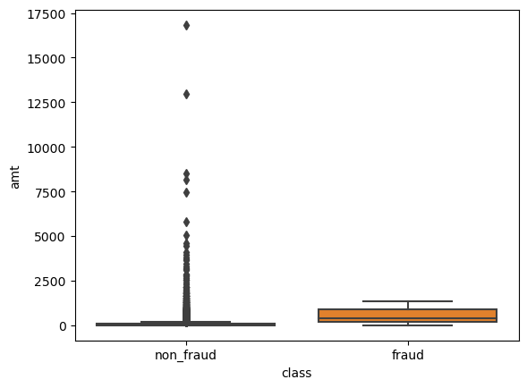
    


```python
#Correlation between columns of the data

fig = plt.figure(figsize=(18,9))
sns.heatmap(data.corr(),cmap='coolwarm', annot=True)
plt.show()
```

    C:\Users\harshitha.palla\AppData\Local\Temp\ipykernel_19932\3117837662.py:4: FutureWarning: The default value of numeric_only in DataFrame.corr is deprecated. In a future version, it will default to False. Select only valid columns or specify the value of numeric_only to silence this warning.
      sns.heatmap(data.corr(),cmap='coolwarm', annot=True)
    


    

    


```python
#Percentage of fraud and non-fraud transactions in the hour of the day

hour_plot=sns.histplot(data=data, x="hour", hue="is_fraud", common_norm=False,stat='percent')
plt.xticks(np.arange(0,24,1))
hour_plot.set_ylabel('Percentage of fraud or non-fraud transactions')
hour_plot.set_xlabel('Hour of the Day')
plt.legend(labels=['Fraud', 'Not Fraud'])

```


    <matplotlib.legend.Legend at 0x1b91e5ffb80>


    
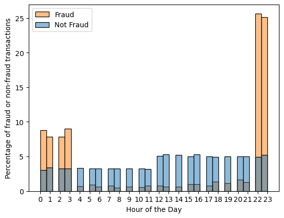
    


```python
#	Percentage of fraud and non-fraud transactions in the days of a week 

day_plot=sns.histplot(data=data, x="day", hue="is_fraud", common_norm=False,stat='percent',multiple='dodge')
day_plot.set_xticklabels(["Mon","Tue","Wed","Thu","Fri","Sat","Sun"])
day_plot.set_ylabel('Percentage')
day_plot.set_xlabel('Day of Week')
plt.legend(labels=['Fraud', 'Not Fraud'])
```

    C:\Users\harshitha.palla\AppData\Local\Temp\ipykernel_19932\3981283542.py:4: UserWarning: FixedFormatter should only be used together with FixedLocator
      day_plot.set_xticklabels(["Mon","Tue","Wed","Thu","Fri","Sat","Sun"])
    


    <matplotlib.legend.Legend at 0x1b91e3a2950>


    
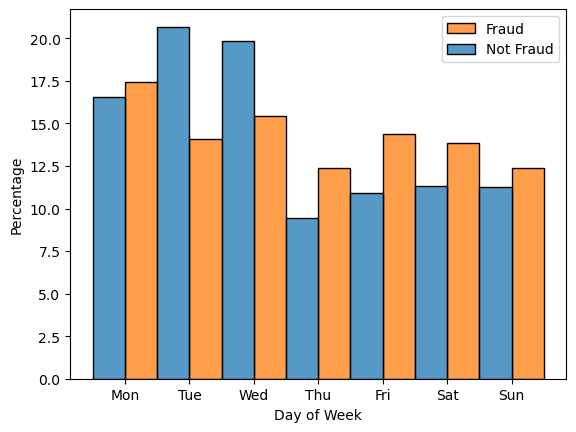
    


## One Hot Encoding


```python
# one hot encoding for - category, gender, day, age

ohe_category = pd.get_dummies(data.category, prefix='category', drop_first=True)

ohe_gender = pd.get_dummies(data.gender, prefix='gender', drop_first=True)

ohe_day_of_week = pd.get_dummies(data.day, prefix='day', drop_first=True)

```


```python
# concatenation of encoded data to our dataset

data_new = pd.concat([data, ohe_category, ohe_gender, ohe_day_of_week], axis=1)

data_new.head()
```


<div>
<style scoped>
    .dataframe tbody tr th:only-of-type {
        vertical-align: middle;
    }

    .dataframe tbody tr th {
        vertical-align: top;
    }

    .dataframe thead th {
        text-align: right;
    }
</style>
<table border="1" class="dataframe">
  <thead>
    <tr style="text-align: right;">
      <th></th>
      <th>cc_num</th>
      <th>merchant</th>
      <th>category</th>
      <th>amt</th>
      <th>gender</th>
      <th>street</th>
      <th>city</th>
      <th>state</th>
      <th>zip</th>
      <th>lat</th>
      <th>...</th>
      <th>category_shopping_net</th>
      <th>category_shopping_pos</th>
      <th>category_travel</th>
      <th>gender_M</th>
      <th>day_Mon</th>
      <th>day_Sat</th>
      <th>day_Sun</th>
      <th>day_Thu</th>
      <th>day_Tue</th>
      <th>day_Wed</th>
    </tr>
  </thead>
  <tbody>
    <tr>
      <th>0</th>
      <td>30407675418785</td>
      <td>fraud_Daugherty LLC</td>
      <td>kids_pets</td>
      <td>19.55</td>
      <td>F</td>
      <td>76752 David Lodge Apt. 064</td>
      <td>Breesport</td>
      <td>NY</td>
      <td>14816</td>
      <td>42.1939</td>
      <td>...</td>
      <td>0</td>
      <td>0</td>
      <td>0</td>
      <td>0</td>
      <td>0</td>
      <td>0</td>
      <td>1</td>
      <td>0</td>
      <td>0</td>
      <td>0</td>
    </tr>
    <tr>
      <th>1</th>
      <td>571465035400</td>
      <td>fraud_Gottlieb Group</td>
      <td>kids_pets</td>
      <td>42.40</td>
      <td>M</td>
      <td>45654 Hess Rest</td>
      <td>Fort Washakie</td>
      <td>WY</td>
      <td>82514</td>
      <td>43.0048</td>
      <td>...</td>
      <td>0</td>
      <td>0</td>
      <td>0</td>
      <td>1</td>
      <td>0</td>
      <td>0</td>
      <td>1</td>
      <td>0</td>
      <td>0</td>
      <td>0</td>
    </tr>
    <tr>
      <th>2</th>
      <td>4570636521433188</td>
      <td>fraud_Welch, Rath and Koepp</td>
      <td>entertainment</td>
      <td>24.73</td>
      <td>F</td>
      <td>5097 Jodi Vista Suite 811</td>
      <td>Deltona</td>
      <td>FL</td>
      <td>32725</td>
      <td>28.8989</td>
      <td>...</td>
      <td>0</td>
      <td>0</td>
      <td>0</td>
      <td>0</td>
      <td>0</td>
      <td>0</td>
      <td>1</td>
      <td>0</td>
      <td>0</td>
      <td>0</td>
    </tr>
    <tr>
      <th>3</th>
      <td>379897244598068</td>
      <td>fraud_Kautzer and Sons</td>
      <td>personal_care</td>
      <td>176.23</td>
      <td>M</td>
      <td>5537 Jessica Plaza</td>
      <td>Pewee Valley</td>
      <td>KY</td>
      <td>40056</td>
      <td>38.3039</td>
      <td>...</td>
      <td>0</td>
      <td>0</td>
      <td>0</td>
      <td>1</td>
      <td>0</td>
      <td>0</td>
      <td>1</td>
      <td>0</td>
      <td>0</td>
      <td>0</td>
    </tr>
    <tr>
      <th>4</th>
      <td>4302475216404898</td>
      <td>fraud_Zemlak, Tillman and Cremin</td>
      <td>personal_care</td>
      <td>19.03</td>
      <td>M</td>
      <td>384 Newman Forks Apt. 370</td>
      <td>Belmond</td>
      <td>IA</td>
      <td>50421</td>
      <td>42.8511</td>
      <td>...</td>
      <td>0</td>
      <td>0</td>
      <td>0</td>
      <td>1</td>
      <td>0</td>
      <td>0</td>
      <td>1</td>
      <td>0</td>
      <td>0</td>
      <td>0</td>
    </tr>
  </tbody>
</table>
<p>5 rows × 42 columns</p>
</div>


```python
data_new.columns
```


    Index(['cc_num', 'merchant', 'category', 'amt', 'gender', 'street', 'city',
           'state', 'zip', 'lat', 'long', 'city_pop', 'job', 'trans_num',
           'unix_time', 'merch_lat', 'merch_long', 'is_fraud', 'hour', 'day',
           'year-month', 'age', 'category_food_dining', 'category_gas_transport',
           'category_grocery_net', 'category_grocery_pos',
           'category_health_fitness', 'category_home', 'category_kids_pets',
           'category_misc_net', 'category_misc_pos', 'category_personal_care',
           'category_shopping_net', 'category_shopping_pos', 'category_travel',
           'gender_M', 'day_Mon', 'day_Sat', 'day_Sun', 'day_Thu', 'day_Tue',
           'day_Wed'],
          dtype='object')


```python
# dropping unwanted columns

data_new.drop(['merchant','street','city','state','job', 'category','gender','day'],
              axis=1, inplace=True)

```


```python
data_new.columns
```


    Index(['cc_num', 'amt', 'zip', 'lat', 'long', 'city_pop', 'trans_num',
           'unix_time', 'merch_lat', 'merch_long', 'is_fraud', 'hour',
           'year-month', 'age', 'category_food_dining', 'category_gas_transport',
           'category_grocery_net', 'category_grocery_pos',
           'category_health_fitness', 'category_home', 'category_kids_pets',
           'category_misc_net', 'category_misc_pos', 'category_personal_care',
           'category_shopping_net', 'category_shopping_pos', 'category_travel',
           'gender_M', 'day_Mon', 'day_Sat', 'day_Sun', 'day_Thu', 'day_Tue',
           'day_Wed'],
          dtype='object')


## Logistic Regression


```python
#collecting numerical Data

data_lr = data_new.select_dtypes(include='number')
```


```python
data_lr.columns
```


    Index(['cc_num', 'amt', 'zip', 'lat', 'long', 'city_pop', 'unix_time',
           'merch_lat', 'merch_long', 'is_fraud', 'hour', 'age',
           'category_food_dining', 'category_gas_transport',
           'category_grocery_net', 'category_grocery_pos',
           'category_health_fitness', 'category_home', 'category_kids_pets',
           'category_misc_net', 'category_misc_pos', 'category_personal_care',
           'category_shopping_net', 'category_shopping_pos', 'category_travel',
           'gender_M', 'day_Mon', 'day_Sat', 'day_Sun', 'day_Thu', 'day_Tue',
           'day_Wed'],
          dtype='object')


```python
#dropping less significant columns

data_lr.drop(['zip', 'lat', 'long', 'city_pop', 'unix_time', 'merch_lat','merch_long'],axis=1, inplace=True)

```


```python
data_lr
```


<div>
<style scoped>
    .dataframe tbody tr th:only-of-type {
        vertical-align: middle;
    }

    .dataframe tbody tr th {
        vertical-align: top;
    }

    .dataframe thead th {
        text-align: right;
    }
</style>
<table border="1" class="dataframe">
  <thead>
    <tr style="text-align: right;">
      <th></th>
      <th>cc_num</th>
      <th>amt</th>
      <th>is_fraud</th>
      <th>hour</th>
      <th>age</th>
      <th>category_food_dining</th>
      <th>category_gas_transport</th>
      <th>category_grocery_net</th>
      <th>category_grocery_pos</th>
      <th>category_health_fitness</th>
      <th>...</th>
      <th>category_shopping_net</th>
      <th>category_shopping_pos</th>
      <th>category_travel</th>
      <th>gender_M</th>
      <th>day_Mon</th>
      <th>day_Sat</th>
      <th>day_Sun</th>
      <th>day_Thu</th>
      <th>day_Tue</th>
      <th>day_Wed</th>
    </tr>
  </thead>
  <tbody>
    <tr>
      <th>0</th>
      <td>30407675418785</td>
      <td>19.55</td>
      <td>0</td>
      <td>12</td>
      <td>29</td>
      <td>0</td>
      <td>0</td>
      <td>0</td>
      <td>0</td>
      <td>0</td>
      <td>...</td>
      <td>0</td>
      <td>0</td>
      <td>0</td>
      <td>0</td>
      <td>0</td>
      <td>0</td>
      <td>1</td>
      <td>0</td>
      <td>0</td>
      <td>0</td>
    </tr>
    <tr>
      <th>1</th>
      <td>571465035400</td>
      <td>42.40</td>
      <td>0</td>
      <td>12</td>
      <td>44</td>
      <td>0</td>
      <td>0</td>
      <td>0</td>
      <td>0</td>
      <td>0</td>
      <td>...</td>
      <td>0</td>
      <td>0</td>
      <td>0</td>
      <td>1</td>
      <td>0</td>
      <td>0</td>
      <td>1</td>
      <td>0</td>
      <td>0</td>
      <td>0</td>
    </tr>
    <tr>
      <th>2</th>
      <td>4570636521433188</td>
      <td>24.73</td>
      <td>0</td>
      <td>12</td>
      <td>32</td>
      <td>0</td>
      <td>0</td>
      <td>0</td>
      <td>0</td>
      <td>0</td>
      <td>...</td>
      <td>0</td>
      <td>0</td>
      <td>0</td>
      <td>0</td>
      <td>0</td>
      <td>0</td>
      <td>1</td>
      <td>0</td>
      <td>0</td>
      <td>0</td>
    </tr>
    <tr>
      <th>3</th>
      <td>379897244598068</td>
      <td>176.23</td>
      <td>0</td>
      <td>12</td>
      <td>90</td>
      <td>0</td>
      <td>0</td>
      <td>0</td>
      <td>0</td>
      <td>0</td>
      <td>...</td>
      <td>0</td>
      <td>0</td>
      <td>0</td>
      <td>1</td>
      <td>0</td>
      <td>0</td>
      <td>1</td>
      <td>0</td>
      <td>0</td>
      <td>0</td>
    </tr>
    <tr>
      <th>4</th>
      <td>4302475216404898</td>
      <td>19.03</td>
      <td>0</td>
      <td>12</td>
      <td>56</td>
      <td>0</td>
      <td>0</td>
      <td>0</td>
      <td>0</td>
      <td>0</td>
      <td>...</td>
      <td>0</td>
      <td>0</td>
      <td>0</td>
      <td>1</td>
      <td>0</td>
      <td>0</td>
      <td>1</td>
      <td>0</td>
      <td>0</td>
      <td>0</td>
    </tr>
    <tr>
      <th>...</th>
      <td>...</td>
      <td>...</td>
      <td>...</td>
      <td>...</td>
      <td>...</td>
      <td>...</td>
      <td>...</td>
      <td>...</td>
      <td>...</td>
      <td>...</td>
      <td>...</td>
      <td>...</td>
      <td>...</td>
      <td>...</td>
      <td>...</td>
      <td>...</td>
      <td>...</td>
      <td>...</td>
      <td>...</td>
      <td>...</td>
      <td>...</td>
    </tr>
    <tr>
      <th>55714</th>
      <td>30197398657930</td>
      <td>1.40</td>
      <td>0</td>
      <td>23</td>
      <td>33</td>
      <td>0</td>
      <td>0</td>
      <td>0</td>
      <td>0</td>
      <td>0</td>
      <td>...</td>
      <td>0</td>
      <td>1</td>
      <td>0</td>
      <td>0</td>
      <td>0</td>
      <td>0</td>
      <td>0</td>
      <td>1</td>
      <td>0</td>
      <td>0</td>
    </tr>
    <tr>
      <th>55715</th>
      <td>213112402583773</td>
      <td>25.49</td>
      <td>0</td>
      <td>23</td>
      <td>37</td>
      <td>0</td>
      <td>0</td>
      <td>0</td>
      <td>0</td>
      <td>0</td>
      <td>...</td>
      <td>0</td>
      <td>1</td>
      <td>0</td>
      <td>0</td>
      <td>0</td>
      <td>0</td>
      <td>0</td>
      <td>1</td>
      <td>0</td>
      <td>0</td>
    </tr>
    <tr>
      <th>55716</th>
      <td>3524574586339330</td>
      <td>29.56</td>
      <td>0</td>
      <td>23</td>
      <td>35</td>
      <td>0</td>
      <td>0</td>
      <td>0</td>
      <td>0</td>
      <td>0</td>
      <td>...</td>
      <td>1</td>
      <td>0</td>
      <td>0</td>
      <td>0</td>
      <td>0</td>
      <td>0</td>
      <td>0</td>
      <td>1</td>
      <td>0</td>
      <td>0</td>
    </tr>
    <tr>
      <th>55717</th>
      <td>3523843138706408</td>
      <td>17.00</td>
      <td>0</td>
      <td>23</td>
      <td>50</td>
      <td>0</td>
      <td>0</td>
      <td>0</td>
      <td>0</td>
      <td>0</td>
      <td>...</td>
      <td>0</td>
      <td>0</td>
      <td>0</td>
      <td>0</td>
      <td>0</td>
      <td>0</td>
      <td>0</td>
      <td>1</td>
      <td>0</td>
      <td>0</td>
    </tr>
    <tr>
      <th>55718</th>
      <td>4079773899158</td>
      <td>7.99</td>
      <td>0</td>
      <td>23</td>
      <td>55</td>
      <td>0</td>
      <td>0</td>
      <td>0</td>
      <td>0</td>
      <td>0</td>
      <td>...</td>
      <td>0</td>
      <td>0</td>
      <td>1</td>
      <td>1</td>
      <td>0</td>
      <td>0</td>
      <td>0</td>
      <td>1</td>
      <td>0</td>
      <td>0</td>
    </tr>
  </tbody>
</table>
<p>55719 rows × 25 columns</p>
</div>


```python
#feature selection

target = data_lr.is_fraud.values
features = data_lr.drop(['is_fraud'],axis=1).values
```


```python
#feature scaling

features = StandardScaler().fit_transform(features)

```


```python
#train, test, split 

from sklearn.model_selection import train_test_split
features_train, features_test, target_train, target_test = train_test_split(features, target, test_size=0.2, random_state=42)

```


```python
#Prediction 

lr = LogisticRegression(random_state=22)

model = lr.fit(features_train, target_train)

target_train_pred = model.predict(features_train)
target_test_pred = model.predict(features_test)

```


```python
print('target_train_pred: ',target_train_pred)
print('target_test_pred: ', target_test_pred)
```

    target_train_pred:  [0 0 0 ... 0 0 0]
    target_test_pred:  [0 0 0 ... 0 0 0]
    

## Model evaluation


```python
#evaluating the model

#Accuracy, Preciision, Recall, F1 score, 
accuracy = accuracy_score(target_test,target_test_pred)
precision = precision_score(target_test, target_test_pred)
recall = recall_score(target_test,target_test_pred)
f1 = f1_score(target_test, target_test_pred)


df = pd.DataFrame([[accuracy, precision, recall, f1]], 
                           columns=['Accuracy', 'Precision', 'Recall', 'F1 Score'])
df

```


<div>
<style scoped>
    .dataframe tbody tr th:only-of-type {
        vertical-align: middle;
    }

    .dataframe tbody tr th {
        vertical-align: top;
    }

    .dataframe thead th {
        text-align: right;
    }
</style>
<table border="1" class="dataframe">
  <thead>
    <tr style="text-align: right;">
      <th></th>
      <th>Accuracy</th>
      <th>Precision</th>
      <th>Recall</th>
      <th>F1 Score</th>
    </tr>
  </thead>
  <tbody>
    <tr>
      <th>0</th>
      <td>0.990668</td>
      <td>0.903382</td>
      <td>0.853881</td>
      <td>0.877934</td>
    </tr>
  </tbody>
</table>
</div>


```python
# evaluation training

#Accuracy, Preciision, Recall, F1 score, 
accuracy = accuracy_score(target_train,target_train_pred)
precision = precision_score(target_train, target_train_pred)
recall = recall_score(target_train,target_train_pred)
f1 = f1_score(target_train, target_train_pred)


df = pd.DataFrame([[accuracy, precision, recall, f1]], 
                           columns=['Accuracy', 'Precision', 'Recall', 'F1 Score'])
df
```


<div>
<style scoped>
    .dataframe tbody tr th:only-of-type {
        vertical-align: middle;
    }

    .dataframe tbody tr th {
        vertical-align: top;
    }

    .dataframe thead th {
        text-align: right;
    }
</style>
<table border="1" class="dataframe">
  <thead>
    <tr style="text-align: right;">
      <th></th>
      <th>Accuracy</th>
      <th>Precision</th>
      <th>Recall</th>
      <th>F1 Score</th>
    </tr>
  </thead>
  <tbody>
    <tr>
      <th>0</th>
      <td>0.973797</td>
      <td>0.831488</td>
      <td>0.396016</td>
      <td>0.536508</td>
    </tr>
  </tbody>
</table>
</div>


```python
#Confusion matrix 

c = confusion_matrix(target_test, target_test_pred)
sns.heatmap(c, annot=True, cmap='Blues', fmt='g')
plt.xlabel('Predicted')
plt.ylabel('True')
plt.show()
```


    
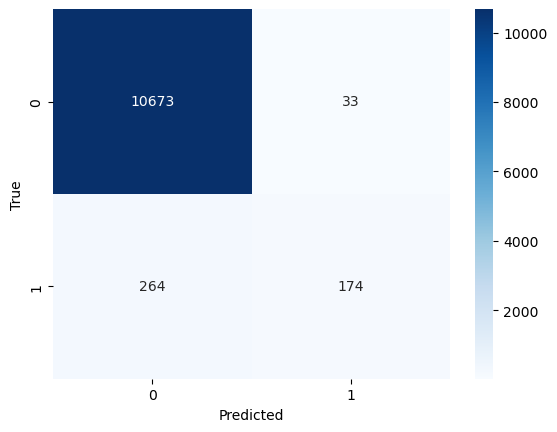
    


# Decision Tree


```python
#test train split

features_train, features_test, target_train, target_test = train_test_split(features,target, 
                                                                            test_size=0.2, random_state=42)

```


```python
#prediction

dt = DecisionTreeClassifier(max_depth=12)
model = dt.fit(features_train,target_train)
target_test_pred = model.predict(features_test)
print(target_test_pred)
```

    [0 0 0 ... 0 0 0]
    


```python
target_train_pred = model.predict(features_train)
```

## Model evaluation


```python
#evaluation

#Accuracy, Preciision, Recall, F1 score, 
accuracy = accuracy_score(target_test,target_test_pred)
precision = precision_score(target_test, target_test_pred)
recall = recall_score(target_test,target_test_pred)
f1 = f1_score(target_test, target_test_pred)


df = pd.DataFrame([[accuracy, precision, recall, f1]], 
                           columns=['Accuracy', 'Precision', 'Recall', 'F1 Score'])
df

```


<div>
<style scoped>
    .dataframe tbody tr th:only-of-type {
        vertical-align: middle;
    }

    .dataframe tbody tr th {
        vertical-align: top;
    }

    .dataframe thead th {
        text-align: right;
    }
</style>
<table border="1" class="dataframe">
  <thead>
    <tr style="text-align: right;">
      <th></th>
      <th>Accuracy</th>
      <th>Precision</th>
      <th>Recall</th>
      <th>F1 Score</th>
    </tr>
  </thead>
  <tbody>
    <tr>
      <th>0</th>
      <td>0.990668</td>
      <td>0.903382</td>
      <td>0.853881</td>
      <td>0.877934</td>
    </tr>
  </tbody>
</table>
</div>


```python
# evaluation training

#Accuracy, Preciision, Recall, F1 score, 
accuracy = accuracy_score(target_train,target_train_pred)
precision = precision_score(target_train, target_train_pred)
recall = recall_score(target_train,target_train_pred)
f1 = f1_score(target_train, target_train_pred)


df = pd.DataFrame([[accuracy, precision, recall, f1]], 
                           columns=['Accuracy', 'Precision', 'Recall', 'F1 Score'])
df
```


<div>
<style scoped>
    .dataframe tbody tr th:only-of-type {
        vertical-align: middle;
    }

    .dataframe tbody tr th {
        vertical-align: top;
    }

    .dataframe thead th {
        text-align: right;
    }
</style>
<table border="1" class="dataframe">
  <thead>
    <tr style="text-align: right;">
      <th></th>
      <th>Accuracy</th>
      <th>Precision</th>
      <th>Recall</th>
      <th>F1 Score</th>
    </tr>
  </thead>
  <tbody>
    <tr>
      <th>0</th>
      <td>0.997398</td>
      <td>0.985357</td>
      <td>0.946104</td>
      <td>0.965332</td>
    </tr>
  </tbody>
</table>
</div>


```python

graph_features = data_lr.drop(['is_fraud','category_food_dining',
       'category_gas_transport', 'category_grocery_net',
       'category_grocery_pos', 'category_health_fitness', 'category_home',
       'category_kids_pets', 'category_misc_net', 'category_misc_pos',
       'category_personal_care', 'category_shopping_net',
       'category_shopping_pos', 'category_travel', 'day_Mon',
       'day_Sat', 'day_Sun', 'day_Thu', 'day_Tue', 'day_Wed'],axis=1)

fraud_or_not = data_lr.is_fraud

print(graph_features.columns)


```

    Index(['cc_num', 'amt', 'hour', 'age', 'gender_M'], dtype='object')
    


```python
#Decision Tree heatmap 

dt2 = DecisionTreeClassifier()
dt2.fit(graph_features, fraud_or_not)

importance = dt2.feature_importances_

fig, ax = plt.subplots()
im = ax.imshow(importance.reshape(1, -1), cmap='coolwarm')
ax.set_xticks(np.arange(5))
ax.set_xticklabels(graph_features.columns)
cbar = ax.figure.colorbar(im, ax=ax)
ax.set_xlabel('Features')
ax.set_ylabel('Level')
plt.show()

```


    
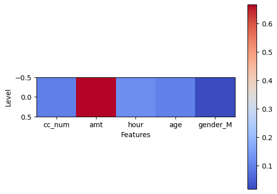
    


# Random Forest


```python
# test train split

features_train, features_test, target_train, target_test = train_test_split(features,target, 
                                                                            test_size=0.2, random_state=42)
```


```python
#model

rf = RandomForestClassifier(n_estimators=70, 
                            random_state=34, 
                            n_jobs=-1)
model = rf.fit(features_train,target_train)

```


```python
#prediction

target_test_pred = model.predict(features_test)
print(target_test_pred)
```

    [0 0 0 ... 0 0 0]
    

## Model Evaluation


```python
#evaluating the model

#Accuracy, Preciision, Recall, F1 score, 
accuracy = accuracy_score(target_test,target_test_pred)
precision = precision_score(target_test, target_test_pred)
recall = recall_score(target_test,target_test_pred)
f1 = f1_score(target_test, target_test_pred)


df = pd.DataFrame([[accuracy, precision, recall, f1]], 
                           columns=['Accuracy', 'Precision', 'Recall', 'F1 Score'])
df
```


<div>
<style scoped>
    .dataframe tbody tr th:only-of-type {
        vertical-align: middle;
    }

    .dataframe tbody tr th {
        vertical-align: top;
    }

    .dataframe thead th {
        text-align: right;
    }
</style>
<table border="1" class="dataframe">
  <thead>
    <tr style="text-align: right;">
      <th></th>
      <th>Accuracy</th>
      <th>Precision</th>
      <th>Recall</th>
      <th>F1 Score</th>
    </tr>
  </thead>
  <tbody>
    <tr>
      <th>0</th>
      <td>0.991116</td>
      <td>0.972145</td>
      <td>0.796804</td>
      <td>0.875784</td>
    </tr>
  </tbody>
</table>
</div>


```python
# Confusion Matrix

c = confusion_matrix(target_test, target_test_pred)
sns.heatmap(c, annot=True, cmap='Greens', fmt='g')
plt.xlabel('Predicted')
plt.ylabel('True')
plt.show()
```


    
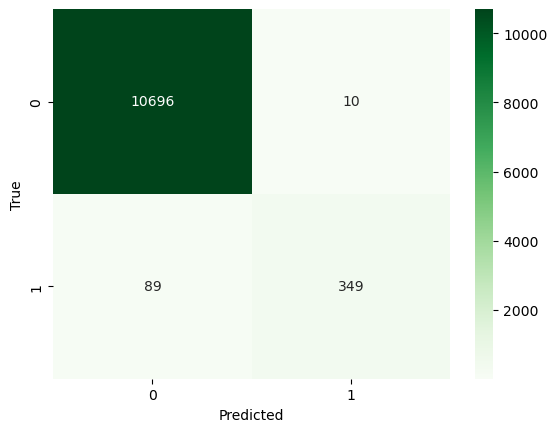
    


```python
#Feature Importance Plot

#Calculating importance of features

importance_scores = model.feature_importances_
feature_names = data_lr.drop(['is_fraud'],axis=1).columns
sorted_indices = importance_scores.argsort()[::-1]
sorted_importance_scores = importance_scores[sorted_indices]
sorted_feature_names = feature_names[sorted_indices]

#plot

fig, ax = plt.subplots(figsize=(10, 6))
ax.bar(sorted_feature_names, sorted_importance_scores)
ax.set_xticklabels(sorted_feature_names, rotation=45, ha='right')
ax.set_title("Feature Importances")
ax.set_xlabel("Features")
ax.set_ylabel("Importance Scores")
plt.show()
```

    C:\Users\harshitha.palla\AppData\Local\Temp\ipykernel_19932\1690940902.py:15: UserWarning: FixedFormatter should only be used together with FixedLocator
      ax.set_xticklabels(sorted_feature_names, rotation=45, ha='right')
    


    
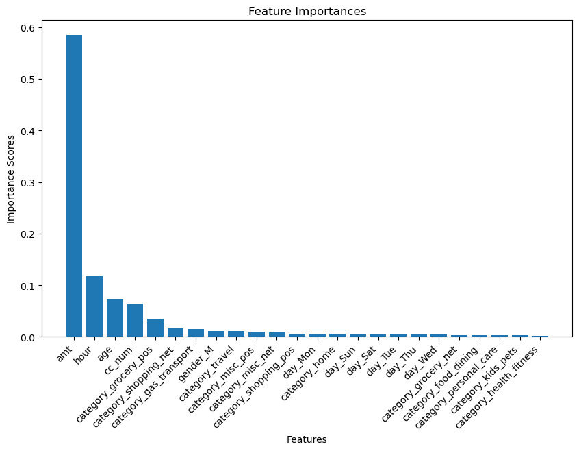
    


# Naive Bayes


```python
# test train split

features_train, features_test, target_train, target_test = train_test_split(features,target, 
                                                                            test_size=0.2,random_state=42, 
                                                                            )

```


```python
#model

nb = GaussianNB()
nb.fit(features_train,target_train)

```


<style>#sk-container-id-1 {color: black;background-color: white;}#sk-container-id-1 pre{padding: 0;}#sk-container-id-1 div.sk-toggleable {background-color: white;}#sk-container-id-1 label.sk-toggleable__label {cursor: pointer;display: block;width: 100%;margin-bottom: 0;padding: 0.3em;box-sizing: border-box;text-align: center;}#sk-container-id-1 label.sk-toggleable__label-arrow:before {content: "▸";float: left;margin-right: 0.25em;color: #696969;}#sk-container-id-1 label.sk-toggleable__label-arrow:hover:before {color: black;}#sk-container-id-1 div.sk-estimator:hover label.sk-toggleable__label-arrow:before {color: black;}#sk-container-id-1 div.sk-toggleable__content {max-height: 0;max-width: 0;overflow: hidden;text-align: left;background-color: #f0f8ff;}#sk-container-id-1 div.sk-toggleable__content pre {margin: 0.2em;color: black;border-radius: 0.25em;background-color: #f0f8ff;}#sk-container-id-1 input.sk-toggleable__control:checked~div.sk-toggleable__content {max-height: 200px;max-width: 100%;overflow: auto;}#sk-container-id-1 input.sk-toggleable__control:checked~label.sk-toggleable__label-arrow:before {content: "▾";}#sk-container-id-1 div.sk-estimator input.sk-toggleable__control:checked~label.sk-toggleable__label {background-color: #d4ebff;}#sk-container-id-1 div.sk-label input.sk-toggleable__control:checked~label.sk-toggleable__label {background-color: #d4ebff;}#sk-container-id-1 input.sk-hidden--visually {border: 0;clip: rect(1px 1px 1px 1px);clip: rect(1px, 1px, 1px, 1px);height: 1px;margin: -1px;overflow: hidden;padding: 0;position: absolute;width: 1px;}#sk-container-id-1 div.sk-estimator {font-family: monospace;background-color: #f0f8ff;border: 1px dotted black;border-radius: 0.25em;box-sizing: border-box;margin-bottom: 0.5em;}#sk-container-id-1 div.sk-estimator:hover {background-color: #d4ebff;}#sk-container-id-1 div.sk-parallel-item::after {content: "";width: 100%;border-bottom: 1px solid gray;flex-grow: 1;}#sk-container-id-1 div.sk-label:hover label.sk-toggleable__label {background-color: #d4ebff;}#sk-container-id-1 div.sk-serial::before {content: "";position: absolute;border-left: 1px solid gray;box-sizing: border-box;top: 0;bottom: 0;left: 50%;z-index: 0;}#sk-container-id-1 div.sk-serial {display: flex;flex-direction: column;align-items: center;background-color: white;padding-right: 0.2em;padding-left: 0.2em;position: relative;}#sk-container-id-1 div.sk-item {position: relative;z-index: 1;}#sk-container-id-1 div.sk-parallel {display: flex;align-items: stretch;justify-content: center;background-color: white;position: relative;}#sk-container-id-1 div.sk-item::before, #sk-container-id-1 div.sk-parallel-item::before {content: "";position: absolute;border-left: 1px solid gray;box-sizing: border-box;top: 0;bottom: 0;left: 50%;z-index: -1;}#sk-container-id-1 div.sk-parallel-item {display: flex;flex-direction: column;z-index: 1;position: relative;background-color: white;}#sk-container-id-1 div.sk-parallel-item:first-child::after {align-self: flex-end;width: 50%;}#sk-container-id-1 div.sk-parallel-item:last-child::after {align-self: flex-start;width: 50%;}#sk-container-id-1 div.sk-parallel-item:only-child::after {width: 0;}#sk-container-id-1 div.sk-dashed-wrapped {border: 1px dashed gray;margin: 0 0.4em 0.5em 0.4em;box-sizing: border-box;padding-bottom: 0.4em;background-color: white;}#sk-container-id-1 div.sk-label label {font-family: monospace;font-weight: bold;display: inline-block;line-height: 1.2em;}#sk-container-id-1 div.sk-label-container {text-align: center;}#sk-container-id-1 div.sk-container {/* jupyter's `normalize.less` sets `[hidden] { display: none; }` but bootstrap.min.css set `[hidden] { display: none !important; }` so we also need the `!important` here to be able to override the default hidden behavior on the sphinx rendered scikit-learn.org. See: https://github.com/scikit-learn/scikit-learn/issues/21755 */display: inline-block !important;position: relative;}#sk-container-id-1 div.sk-text-repr-fallback {display: none;}</style><div id="sk-container-id-1" class="sk-top-container"><div class="sk-text-repr-fallback"><pre>GaussianNB()</pre><b>In a Jupyter environment, please rerun this cell to show the HTML representation or trust the notebook. <br />On GitHub, the HTML representation is unable to render, please try loading this page with nbviewer.org.</b></div><div class="sk-container" hidden><div class="sk-item"><div class="sk-estimator sk-toggleable"><input class="sk-toggleable__control sk-hidden--visually" id="sk-estimator-id-1" type="checkbox" checked><label for="sk-estimator-id-1" class="sk-toggleable__label sk-toggleable__label-arrow">GaussianNB</label><div class="sk-toggleable__content"><pre>GaussianNB()</pre></div></div></div></div></div>


```python
#prediction

target_test_pred = nb.predict(features_test)
target_pred_prob = nb.predict_proba(features_test) 
print('target_train_pred: ',target_train_pred)
print('target_test_pred: ', target_test_pred)
```

    target_train_pred:  [0 0 0 ... 0 0 0]
    target_test_pred:  [1 0 1 ... 1 0 0]
    

## Model Evaluation


```python
# evalluation metrics

#Accuracy, Preciision, Recall, F1 score, 
accuracy = accuracy_score(target_test,target_test_pred)
precision = precision_score(target_test, target_test_pred)
recall = recall_score(target_test,target_test_pred)
f1 = f1_score(target_test, target_test_pred)


df = pd.DataFrame([[accuracy, precision, recall, f1]], 
                           columns=['Accuracy', 'Precision', 'Recall', 'F1 Score'])
df
```


<div>
<style scoped>
    .dataframe tbody tr th:only-of-type {
        vertical-align: middle;
    }

    .dataframe tbody tr th {
        vertical-align: top;
    }

    .dataframe thead th {
        text-align: right;
    }
</style>
<table border="1" class="dataframe">
  <thead>
    <tr style="text-align: right;">
      <th></th>
      <th>Accuracy</th>
      <th>Precision</th>
      <th>Recall</th>
      <th>F1 Score</th>
    </tr>
  </thead>
  <tbody>
    <tr>
      <th>0</th>
      <td>0.796752</td>
      <td>0.122988</td>
      <td>0.680365</td>
      <td>0.208319</td>
    </tr>
  </tbody>
</table>
</div>


# K Means


```python
#train test split
from sklearn.preprocessing import normalize


features_train, features_test, target_train, target_test = train_test_split(features,target, test_size=0.2)

```


```python
#model

km = KMeans(n_clusters=2,random_state=0,algorithm="elkan",max_iter=10000)
km.fit(features_train)


```

    C:\Users\harshitha.palla\AppData\Local\anaconda3\lib\site-packages\sklearn\cluster\_kmeans.py:870: FutureWarning: The default value of `n_init` will change from 10 to 'auto' in 1.4. Set the value of `n_init` explicitly to suppress the warning
      warnings.warn(
    


<style>#sk-container-id-4 {color: black;background-color: white;}#sk-container-id-4 pre{padding: 0;}#sk-container-id-4 div.sk-toggleable {background-color: white;}#sk-container-id-4 label.sk-toggleable__label {cursor: pointer;display: block;width: 100%;margin-bottom: 0;padding: 0.3em;box-sizing: border-box;text-align: center;}#sk-container-id-4 label.sk-toggleable__label-arrow:before {content: "▸";float: left;margin-right: 0.25em;color: #696969;}#sk-container-id-4 label.sk-toggleable__label-arrow:hover:before {color: black;}#sk-container-id-4 div.sk-estimator:hover label.sk-toggleable__label-arrow:before {color: black;}#sk-container-id-4 div.sk-toggleable__content {max-height: 0;max-width: 0;overflow: hidden;text-align: left;background-color: #f0f8ff;}#sk-container-id-4 div.sk-toggleable__content pre {margin: 0.2em;color: black;border-radius: 0.25em;background-color: #f0f8ff;}#sk-container-id-4 input.sk-toggleable__control:checked~div.sk-toggleable__content {max-height: 200px;max-width: 100%;overflow: auto;}#sk-container-id-4 input.sk-toggleable__control:checked~label.sk-toggleable__label-arrow:before {content: "▾";}#sk-container-id-4 div.sk-estimator input.sk-toggleable__control:checked~label.sk-toggleable__label {background-color: #d4ebff;}#sk-container-id-4 div.sk-label input.sk-toggleable__control:checked~label.sk-toggleable__label {background-color: #d4ebff;}#sk-container-id-4 input.sk-hidden--visually {border: 0;clip: rect(1px 1px 1px 1px);clip: rect(1px, 1px, 1px, 1px);height: 1px;margin: -1px;overflow: hidden;padding: 0;position: absolute;width: 1px;}#sk-container-id-4 div.sk-estimator {font-family: monospace;background-color: #f0f8ff;border: 1px dotted black;border-radius: 0.25em;box-sizing: border-box;margin-bottom: 0.5em;}#sk-container-id-4 div.sk-estimator:hover {background-color: #d4ebff;}#sk-container-id-4 div.sk-parallel-item::after {content: "";width: 100%;border-bottom: 1px solid gray;flex-grow: 1;}#sk-container-id-4 div.sk-label:hover label.sk-toggleable__label {background-color: #d4ebff;}#sk-container-id-4 div.sk-serial::before {content: "";position: absolute;border-left: 1px solid gray;box-sizing: border-box;top: 0;bottom: 0;left: 50%;z-index: 0;}#sk-container-id-4 div.sk-serial {display: flex;flex-direction: column;align-items: center;background-color: white;padding-right: 0.2em;padding-left: 0.2em;position: relative;}#sk-container-id-4 div.sk-item {position: relative;z-index: 1;}#sk-container-id-4 div.sk-parallel {display: flex;align-items: stretch;justify-content: center;background-color: white;position: relative;}#sk-container-id-4 div.sk-item::before, #sk-container-id-4 div.sk-parallel-item::before {content: "";position: absolute;border-left: 1px solid gray;box-sizing: border-box;top: 0;bottom: 0;left: 50%;z-index: -1;}#sk-container-id-4 div.sk-parallel-item {display: flex;flex-direction: column;z-index: 1;position: relative;background-color: white;}#sk-container-id-4 div.sk-parallel-item:first-child::after {align-self: flex-end;width: 50%;}#sk-container-id-4 div.sk-parallel-item:last-child::after {align-self: flex-start;width: 50%;}#sk-container-id-4 div.sk-parallel-item:only-child::after {width: 0;}#sk-container-id-4 div.sk-dashed-wrapped {border: 1px dashed gray;margin: 0 0.4em 0.5em 0.4em;box-sizing: border-box;padding-bottom: 0.4em;background-color: white;}#sk-container-id-4 div.sk-label label {font-family: monospace;font-weight: bold;display: inline-block;line-height: 1.2em;}#sk-container-id-4 div.sk-label-container {text-align: center;}#sk-container-id-4 div.sk-container {/* jupyter's `normalize.less` sets `[hidden] { display: none; }` but bootstrap.min.css set `[hidden] { display: none !important; }` so we also need the `!important` here to be able to override the default hidden behavior on the sphinx rendered scikit-learn.org. See: https://github.com/scikit-learn/scikit-learn/issues/21755 */display: inline-block !important;position: relative;}#sk-container-id-4 div.sk-text-repr-fallback {display: none;}</style><div id="sk-container-id-4" class="sk-top-container"><div class="sk-text-repr-fallback"><pre>KMeans(algorithm=&#x27;elkan&#x27;, max_iter=10000, n_clusters=2, random_state=0)</pre><b>In a Jupyter environment, please rerun this cell to show the HTML representation or trust the notebook. <br />On GitHub, the HTML representation is unable to render, please try loading this page with nbviewer.org.</b></div><div class="sk-container" hidden><div class="sk-item"><div class="sk-estimator sk-toggleable"><input class="sk-toggleable__control sk-hidden--visually" id="sk-estimator-id-4" type="checkbox" checked><label for="sk-estimator-id-4" class="sk-toggleable__label sk-toggleable__label-arrow">KMeans</label><div class="sk-toggleable__content"><pre>KMeans(algorithm=&#x27;elkan&#x27;, max_iter=10000, n_clusters=2, random_state=0)</pre></div></div></div></div></div>


```python
#prediction

traget_test_pred = km.predict(features_test)

```

## Model Evaluation


```python
# evaluation 

#Accuracy, Preciision, Recall, F1 score, 
accuracy = accuracy_score(target_test,target_test_pred)
precision = precision_score(target_test, target_test_pred)
recall = recall_score(target_test,target_test_pred)
f1 = f1_score(target_test, target_test_pred)


df = pd.DataFrame([[accuracy, precision, recall, f1]], 
                           columns=['Accuracy', 'Precision', 'Recall', 'F1 Score'])
df

```


<div>
<style scoped>
    .dataframe tbody tr th:only-of-type {
        vertical-align: middle;
    }

    .dataframe tbody tr th {
        vertical-align: top;
    }

    .dataframe thead th {
        text-align: right;
    }
</style>
<table border="1" class="dataframe">
  <thead>
    <tr style="text-align: right;">
      <th></th>
      <th>Accuracy</th>
      <th>Precision</th>
      <th>Recall</th>
      <th>F1 Score</th>
    </tr>
  </thead>
  <tbody>
    <tr>
      <th>0</th>
      <td>0.760589</td>
      <td>0.040446</td>
      <td>0.222222</td>
      <td>0.068436</td>
    </tr>
  </tbody>
</table>
</div>


```python
# evaluation 

#Accuracy, Preciision, Recall, F1 score, 
trn = km.predict(features_train)
accuracy = accuracy_score(target_train,trn)
precision = precision_score(target_train, trn)
recall = recall_score(target_train,trn)
f1 = f1_score(target_train, trn)


df = pd.DataFrame([[accuracy, precision, recall, f1]], 
                           columns=['Accuracy', 'Precision', 'Recall', 'F1 Score'])
df
```


<div>
<style scoped>
    .dataframe tbody tr th:only-of-type {
        vertical-align: middle;
    }

    .dataframe tbody tr th {
        vertical-align: top;
    }

    .dataframe thead th {
        text-align: right;
    }
</style>
<table border="1" class="dataframe">
  <thead>
    <tr style="text-align: right;">
      <th></th>
      <th>Accuracy</th>
      <th>Precision</th>
      <th>Recall</th>
      <th>F1 Score</th>
    </tr>
  </thead>
  <tbody>
    <tr>
      <th>0</th>
      <td>0.60507</td>
      <td>0.040834</td>
      <td>0.414906</td>
      <td>0.074351</td>
    </tr>
  </tbody>
</table>
</div>


```python

c = confusion_matrix(target_test, target_test_pred)
sns.heatmap(c, annot=True, cmap='Greens', fmt='g')
plt.xlabel('Predicted')
plt.ylabel('True')
plt.show()
```


    
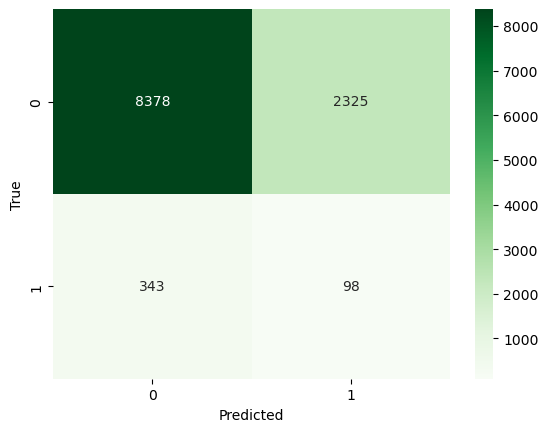
    


```python

```
